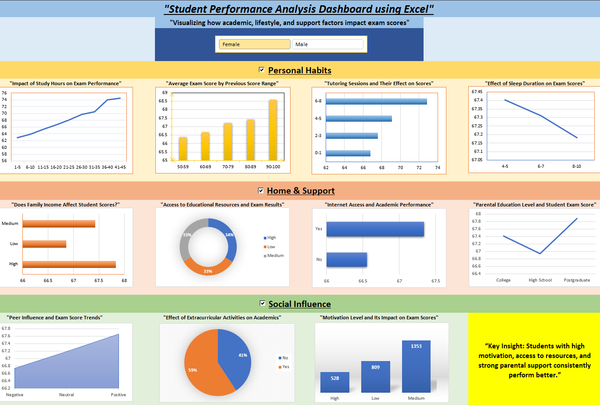

# 📊 Student Performance Analysis Dashboard (Excel)

## 📖 Overview
This project presents an interactive Excel dashboard analyzing how academic, lifestyle, and support factors influence student exam performance.

The dashboard provides insights into patterns affecting student scores using data-driven visualization.

---

## 🚀 Features
- Interactive gender-based filtering (Male/Female)
- Categorized analysis:
  - Personal Habits (Study Hours, Sleep, Tutoring)
  - Home & Support (Income, Internet, Parental Education)
  - Social Influence (Peer Impact, Activities, Motivation)
- Dynamic Pivot Tables and Slicers
- VBA Macros for interactive view control
- Insight summary highlighting key findings

---

## 🛠️ Tools & Technologies
- Microsoft Excel
- Pivot Tables
- Slicers
- VBA (Macros)
- Data Cleaning

---

## 📸 Dashboard Preview
-Dashboard: 

---

## 📊 Dataset
- Source: 
- Size: 1000+ student records

---

## 🎯 Key Insights
- Higher motivation levels correlate with better exam performance
- Access to resources and parental support positively impact scores
- Study habits and sleep patterns influence performance trends

---

## 🔮 Future Improvements
- Integration with SQL database
- Automation using Python
- Advanced statistical analysis

